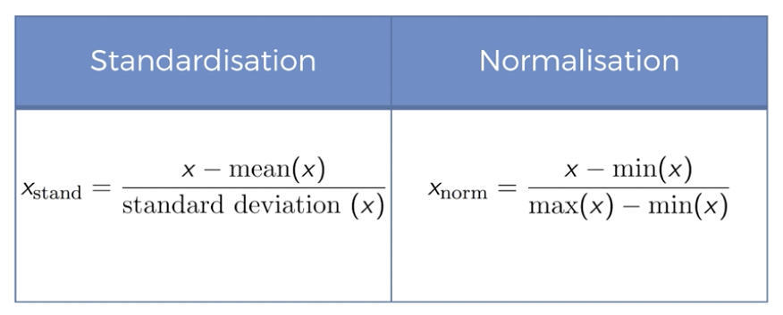

# Data Preprocessing

download data set from https://www.superdatascience.com/machine-learning/

## Missing data

`Lib: sklearn`

```python
from sklearn.preprocessing import Imputer
```

`Imputer`

```python
Definition : Imputer(missing_values="NaN", strategy="mean", axis=0, verbose=0, copy=True)
Type : Present in sklearn.preprocessing.imputation module
```

> Parameters ( __command + i__ to check help of class)

- missing_values

  The placeholder for the missing values. All occurrences of missing_values will be imputed. For missing values encoded as np.nan, use the string value “NaN”.

- strategy

  The imputation strategy.
  - If “mean”, then replace missing values using the mean along the axis. (平均)
  - If “median”, then replace missing values using the median along the axis.(中位数)
  - If “most_frequent”, then replace missing using the most frequent value along the axis.  (最高频数)

- axis

  The axis along which to impute.
  - If axis=0, then impute along columns.
  - If axis=1, then impute along rows.

- verboseThe imputation strategy.If “mean”, then rep

  Controls the verbosity of the imputer.

- copy

  If True, a copy of X will be created. 
  If False, imputation will be done in-place whenever possible. 
  Note that, in the following cases, a new copy will always be made, even if copy=False:
  - If X is not an array of floating values;
  - If X is sparse and missing_values=0;
  - If axis=0 and X is encoded as a CSR matrix;
  - If axis=1 and X is encoded as a CSC matrix.


## Encoding Categorical data

把可能性的value/String 转换为数字

`LabelEncoder`  把string标签变成整数

`OneHotEncoder` 是针对没有大小，顺序的标签，按照bit做数值映射 

```python
# Encoding catogorical data

from sklearn.preprocessing import LabelEncoder, OneHotEncoder

labelEncoder_X = LabelEncoder()
X[:,0] = labelEncoder_X.fit_transform(X[:,0])
# dummy encoding to make values without order

oneHotEncoder = OneHotEncoder(categorical_features = [0])
X = oneHotEncoder.fit_transform(X).toarray()
```


## Splitting the dataset into the Training set and Test set

把数据分成训练组和验证组

```python
from sklearn.cross_validation import train_test_split
X_train, X_test, y_train, y_test = train_test_split(X, y, test_size = 0.2, random_state = 0)
```

## Feature scaling

> [euclidean distance](https://zh.wikipedia.org/wiki/%E6%AC%A7%E5%87%A0%E9%87%8C%E5%BE%97%E8%B7%9D%E7%A6%BB)

`欧氏距离` 

使用测度时候，使得不同维度数字有平方后相加的情况，两者的值域如果相差太大会使得单一测度的值失去意义，所以需要把他们映射到固定的值域去。
即使不涉及欧氏距离这种测度，feature scaling 也会使得计算速度得以提升




> [why fit and transform training set but only transform test set?](https://stackoverflow.com/questions/43675665/when-scale-the-data-why-the-train-dataset-use-fit-and-transform-but-the-te)
 
```
fit() is used to compute the parameter needed for transformation and transform() is for scaling the data to convert into standard format for the model.

fit_tranform() is combination of two which is doing above work in efficiently.

Since fit_transform() is already computing and transforming the training data only transformation for testing data is left,since parameter needed for transformation is already computed and stored only transformation() of testing data is left therefor only transform() is used instead of fit_transform().
```

```python
from sklearn.preprocessing import StandardScaler
sc_X = StandardScaler()
X_train = sc_X.fit_transform(X_train)
X_test = sc_X.transform(X_test)
sc_y = StandardScaler()
y_train = sc_y.fit_transform(y_train)
```


